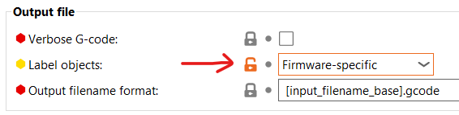
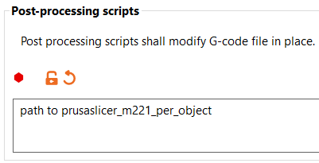

# PrusaSlicer M221 per Object

**My "first" rust project. Bear with me!**

This is a very simple g-code post-processor which enables you to change the flow rate per object.

It adds `M221 S[flow rate]` after each object start.

`[flow rate]` is parsed from the start of the object name.

If the flow rate includes a decimal point you need to replace it by `p` or `P` in the object name.

Parsing ends when either no `p` or `P` is found or after the last digit found. This allows you to still add an object name after the flow rate which is ignore by this script

If no valid flow rate is found the object will be printed with flow rate 100%.

## Slicer Configuration

### Print Settings - Output Options

#### Label Objects

#### Post Processing Script

