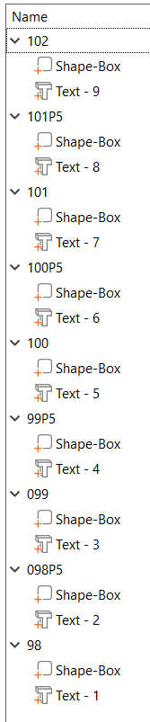
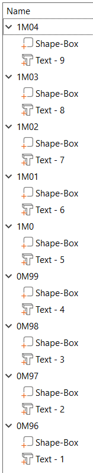
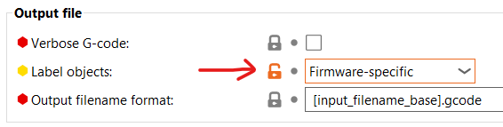
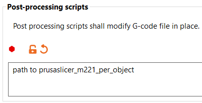

# Documentation

The g-code post-processor adds `M221 S[flow rate]` after each object start.
`[flow rate]` is parsed from the start of the object name.

You have two options to set the new flow rate per object.

## Explicit flow rates (in %)

* Start the object name with your desired flow rate without a decimal point.
* If you need a decimal point you **need** to replace it by `p` or `P`.
* You are free to use any object name after the new flow rate.
* If parsing fails a flow rate of 100 % is used.

The picture below shows explicit flow rates from 102 % down to 98 % in steps of 0.5 %.

## Absolut extrusion multipliers (~ 1.0)

* Start the object name with your desired extrusion multiplier.
* You **need** to use a decimal point and you **need** to replace it by `m` or `M`.
* You are free to use any object name after the new extrusion multiplier.
* If parsing fails a flow rate of 100 % is used.
* If parsing succeds the new flow rate is calculated out of the desired extrusion multiplier and the extrusion multiplier which was used to generate the g-code by Prusa Slicer.

=> Use your desired **absolut** extrusion multipliers!

The picture below shows explicit flow rates from 1.04 down to 0.96 in 0.01 steps

Find an example Prusa Slicer project in this (docs) directory.
It is named 'FlowRate.3mf'.

## Prusa Slicer Configuration

### Print Settings - Output Options

#### Label Objects

#### Post Processing Script

## Build

* Clone repository.
* [Install](https://www.rust-lang.org/tools/install) a rust toolchain.
* Run `cargo build --release`
* The executable is in the target/release directory.
